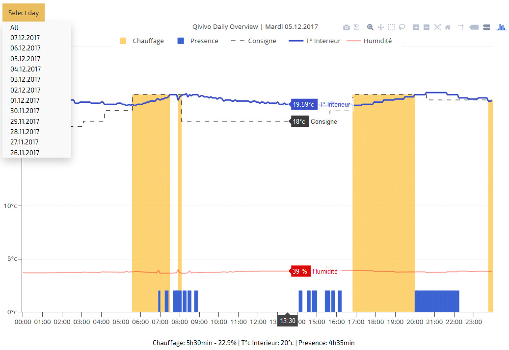

# php-simpleQivivoAPI

## Qivivo Daily Overview

Since summer 2017, new Qivivo customers doesn't have daily overview anymore. Yes you read right, Qivivo removed this feature, but previous customers still have it! Go figure...

Anyway, such feedback is really important to adapt your programs regarding inertia, heating reactivity and such.

Here is a how-to to get your Daily Overview, with full interactivity over the graph (hide some data, zoom, etc.)!

<p align="center">
  
</p>

*On this screen, exterior temperature is reported by Netatmo exterior module. See [SimpleNetatmo](https://github.com/KiboOst/php-simpleNetatmoAPI) if you have such module, as Qivivo API doesn't report it.*

*Note: Qivivo API doesn't report sun conditions. You can customize files to report it on your own if you want.*

## Disclaimer
- The Qivivo API doesn't provide information regarding heating or not.</br>
Heating is computed from order and temperature evolution, with PID formula. This is the default Qivivo behavior, so it may not be reliable if you asked Qivivo to set your thermostat in hysteresis mode (you can even ask them to change delta value for hysteresis). I could easily do an hysteresis mode with custom delta if needed...
- Even if you are in multizone mode, this graph show only thermostat zone. Other zones works with wire order to radiators, and Qivivo has no way to know if a radiator is heating or not, being regulated by its own radiator thermostat.


## Requirements
- [php-simpleQivivoAPI ready to run](https://github.com/KiboOst/php-simpleQivivoAPI)
- qivivoLog.php
- QivivoLog.html
- Display is supported thanks to [jQuery](https://jquery.com/) and [plotly](https://plot.ly/), both linked from their CDN (nothing to install/download)

qivivoLog.json is an example provided to test your setup. Of course you will need your own logs :wink:


## Get logs

You will have to log Qivivo data every 5mins:
- Download qivivoLog.php on your server.
- Edit qivivoLog.php so it can login to your Qivivo account and change path for $logfilePath:
By default, the log file will keep last 90days. Just change $logMaxDays value.

```php
require($_SERVER['DOCUMENT_ROOT'].'/path/to/splQivivoAPI.php'); //Qivivo SDK API
$logfilePath = $_SERVER['DOCUMENT_ROOT'].'/path/to/qivivoLog.json';
$logMaxDays = 90;

$_qivivo = new splQivivoAPI($clienID, $secretID);
if (isset($_qivivo->error)) die($_qivivo->error);

```

Don't touch the rest of the file.

- Call this file every 5mins. You can use IFTTT, set a sheduled task on a NAS, or a cron task on your webserver or whatever will run this php script.

## Display logs

- Download QivivoLog.html on your server
- Edit QivivoLog.html according to your log path:
- *Note: If you want, you can show PID regulation curve in the graph by setting tracePID to 1. If you know what you are doing, you can also adjust PID factors value here.*

```html
<!doctype html>
<script>
    var qivivoLogPath = "qivivoLog.json"

    var logDelta = 5 //number of minutes between logs
    var tracePID = 0 //debug, if 1 will show PID
    var P_factor = 20
    var I_factor = 0.022
    var D_factor = 1.6
</script>
```

Don't touch the rest of the file.

*Note: If you want to add some data (Netatmo external temperature, wind and such), edit qivivoLog.php to log your data, and edit QivivoLog.html drawGraph() function to display your data.*

- Simply load this page in a browser when you have some logs!

## Version history

#### v0.2 (2017-11-28)
- Now computed heating with PID formula.

#### v0.1 (2017-11-27)
- First public version!

## License

The MIT License (MIT)

Copyright (c) 2017 KiboOst

Permission is hereby granted, free of charge, to any person obtaining a copy
of this software and associated documentation files (the "Software"), to deal
in the Software without restriction, including without limitation the rights
to use, copy, modify, merge, publish, distribute, sublicense, and/or sell
copies of the Software, and to permit persons to whom the Software is
furnished to do so, subject to the following conditions:

The above copyright notice and this permission notice shall be included in all
copies or substantial portions of the Software.

THE SOFTWARE IS PROVIDED "AS IS", WITHOUT WARRANTY OF ANY KIND, EXPRESS OR
IMPLIED, INCLUDING BUT NOT LIMITED TO THE WARRANTIES OF MERCHANTABILITY,
FITNESS FOR A PARTICULAR PURPOSE AND NONINFRINGEMENT. IN NO EVENT SHALL THE
AUTHORS OR COPYRIGHT HOLDERS BE LIABLE FOR ANY CLAIM, DAMAGES OR OTHER
LIABILITY, WHETHER IN AN ACTION OF CONTRACT, TORT OR OTHERWISE, ARISING FROM,
OUT OF OR IN CONNECTION WITH THE SOFTWARE OR THE USE OR OTHER DEALINGS IN THE
SOFTWARE.
